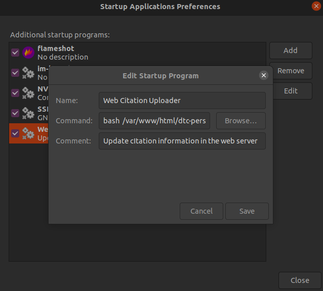

## Demo

Try `testPage.php` first. It should run out of the box.

Note: install SSL if `testPage.php` does not work.

## Configurations

1.  Configure Python envioronment to run `main.py`. You need to install `selenium` package, and download `ChromeDriver` <https://sites.google.com/a/chromium.org/chromedriver/downloads>.

2.  In `main.py`, replace `google_scholar_url` to your Google Scholar and `chrome_driver_path` to the downloaded ChromeDriver. After successfully run it, a `google_scholar_citation.txt` file is generated
    ```python
    # url to your Google Scholar
    google_scholar_url = "https://scholar.google.com/citations?user=Xm4NYnsAAAAJ&hl=en&oi=ao"
    # ChromeDriver path
    chrome_driver_path = "./chromedriver"
    ```

3.  In your web page, add jQuery. The version should be irrelevant. I am using 3.4.1
    ```xml
    <script src=jquery-3.4.1.min.js></script>
    ```

4.  Include `dtcGoogleScholarHelper.js` of this repo.
    ```xml
    <script src="dtc-google-scholar-helper/Python_Offline/dtcGoogleScholarHelper.js"> </script>
    ```

5.  Call the following function in you PhP file.
    ```xml
    <script>
      dtcGoogleScholarHelper();
    </script>
    ```

6.  In `dtcGoogleScholarHelper.js`, you only need to change `pathToGoogleScholarCitationTxt` variable to the path of the `google_scholar_citation.txt`.


### Example Configurations

As an example, if you copy this repository to the root folder of your website, you make the following changes.

In `dtcGoogleScholarHelper.js`
```javascript
pathToGoogleScholarCitationTxt: "dtc-google-scholar-helper/Python_Offline/google_scholar_citation.txt"
```

### Automatic Upload Tool

It is much better if we can upload the updated citation file to our web sever automatically. One way is to upload once your PC boosts. For Ubuntu, you can do this way:

1.  Create SSH Key with your PC and your web server so you do not need to type in password manually. Basically, you can do following commands

    ```shell
    # Check if you have already created SSH Key for your PC
    ls -l ~/.ssh/id_*.pub
    # If not, create one; Enter to accept default file location and file name
    ssh-keygen -t rsa -b 4096 -C "your_email@domain.com"
    # Press Enter for passphrase
    ```

2.  Copy the SSH Key to your web server

    ```shell
    ssh-copy-id remote_username@server_ip_address
    # Type in your password to the remote server
    ```

3.  Test if everything so far is OK, by uploading a file to your web server

    ```shell
    scp -i /path/to/.ssh/id_rsa local_file remote_username@server_ip_address:[destination]
    ```

4.  Test if the `tool.sh` can successfully run your Python code and upload citation file to your server.

    ```shell
    bash tool.sh
    ```

4.  Run the `tool.sh` at PC startup. One easy way is to use the Startup Applications GUI. The **Command** is `bash path_to_tool.sh`.

    


### Reference
*   Introduction to Web Scraping using Selenium. <https://medium.com/the-andela-way/introduction-to-web-scraping-using-selenium-7ec377a8cf72>
