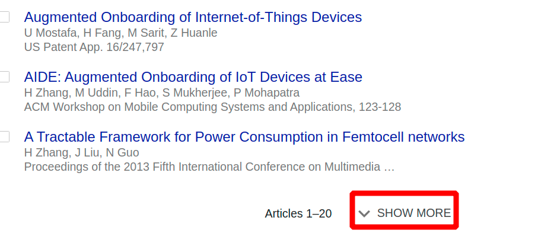

# dtc-google-scholar-helper

&nbsp;

Google scholar provides useful information for e.g, citations for your papers.

This repo can be used to extract information from your Google Scholar and display them in your personal website.

You can go to my web page to have a brief idea of it.

<https://huanlezhang.com/publications.php>

There are two versions.

*   Standalone mode (`Php_Standalone` directory). It is written purely in PHP and Javascript, which means that your website can show the **real-time** Google Scholar citation information. In addition, it is easy to use, just copy to your web server and configure the URL of your Google Scholar. However, it can only display up to 20 articles, as Google Scholar hides the remaining.

    

*   Offline mode (`Python_Offline` directory). In which I write a Python program to extract all citation information from Google Scholar. The Python script generate a text file with all your citation information. Then, you can upload the text file along with a Javascript file to you web server. The advantage is that you can have all your citations. The bad thing is that you need to upload the citation text file to your server by yourself (Of course, you can make an automatic tool to upload the file to your server).

## Interfaces

Both versions have same interfaces for your web pages.

`.innerText` is changed according to the class name.

*   `dtcGoogleCitationsAll`: total citation counts
*   `dtcGoogleCitationsRecent`: total citations counts in recent 5 years
*   `dtcGoogleHIndexAll`: h-index of all citations
*   `dtcGoogleHIndexRecent`: h-index of citations in recent 5 years
*   `dtcGoogleI10IndexAll`: i10-index of all citations
*   `dtcGoogleI10IndexRecent`: i10-index of citations in recent 5 years

For each paper and its citation, you need to use two class names in pair.
*   `dtcGooglePaperTitle`: your paper title
*   `dtcGoogleCitationCount`: the place you want to show its citation count

You need to check the paper title in your Google Scholar and the paper title in your website. I have made paper titles into lowercase alphabetical only. For example, if your paper title in Google Scholar is `Hi, I am an awesome paper`, it converts into `hiiamanawesomepaper`. On your website, your paper will get matched no matter it is `hi, I AM AN aweSOME PAper`, or `HI?    Iam an awesome paper?`. You know what I mean :)
